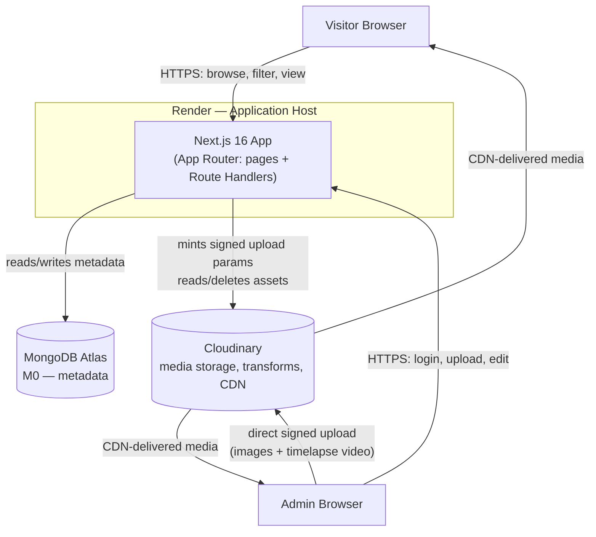
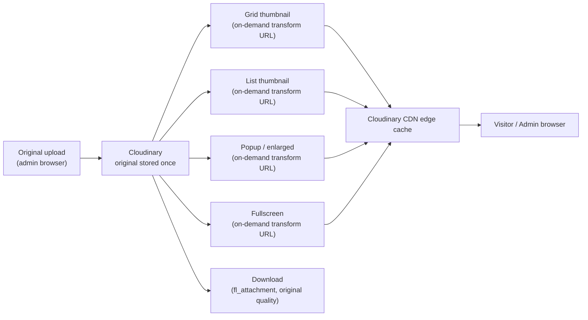

# 03 — System Architecture

> **Precedence: 4th.** This document describes how the pieces specified in `02-Technical-Specification.md` fit together and communicate. It is subordinate to the Constitution, Product Definition, and Technical Specification.

---

## 1. High-Level Architecture

BushArt is a single deployable Next.js application (frontend + API in one codebase) backed by two managed external services. There is no separate backend server, no message queue, and no microservices — deliberately, per the Constitution's "simplicity over unnecessary complexity" principle.



The one deliberately unusual line in this diagram is the **admin browser uploading directly to Cloudinary**, bypassing the Render server entirely for the media bytes themselves. This is explained in §4 and justified in `12-Decision-Log.md` ADR-006.

## 2. Component Responsibilities

| Component | Responsibility |
|---|---|
| **Next.js App (Render)** | Renders the public gallery and admin UI; exposes the REST API (`05-API-Specification.md`); owns all business logic, validation, and authorization; the only component with MongoDB and Cloudinary API-secret credentials. |
| **MongoDB Atlas** | Source of truth for all structured data — artworks, tags, admin accounts, site settings. Stores no media bytes. |
| **Cloudinary** | Source of truth for all media bytes (images, video). Handles transformation, optimization, and CDN delivery. Stores no relational/business data. |
| **Admin Browser** | Runs the same public UI plus admin-only affordances revealed after authentication; uploads media directly to Cloudinary using signatures obtained from the Next.js app. |
| **Visitor Browser** | Runs the public, read-only UI. Never holds elevated credentials. |

This is a clean separation: **MongoDB owns meaning, Cloudinary owns bytes, Next.js owns logic.** No component duplicates another's responsibility, which keeps the system easy to reason about as it grows (Constitution §Engineering Principles).

## 3. Authentication Flow

```mermaid
sequenceDiagram
    participant A as Admin Browser
    participant N as Next.js App
    participant M as MongoDB Atlas

    A->>N: Trigger hidden login control (footer icon or shortcut)
    N-->>A: Render login modal (client-side only, no navigation)
    A->>N: POST /api/auth/login { username, password }
    N->>M: Find admin by username
    M-->>N: Admin doc (hashed password, lockUntil)
    N->>N: Check lockUntil; verify bcrypt hash
    alt credentials valid and not locked
        N->>M: Reset failedLoginAttempts; set lastLoginAt
        N-->>A: 200 OK + Set-Cookie: bushart_session (httpOnly, Secure, SameSite=Lax)
        A->>N: GET /api/auth/me (on subsequent loads)
        N-->>A: { id, username } → admin UI unlocks in place
    else invalid credentials
        N->>M: Increment failedLoginAttempts; set lockUntil if >= 5
        N-->>A: 401 Unauthorized
    end
```

Key properties, expanded from `02-Technical-Specification.md` §4:
- The login control never navigates to a separate `/login` route — it opens as an overlay on the same continuously-scrolling homepage, consistent with the Constitution's "one continuously scrolling page" principle.
- The session cookie is the only piece of client-held state; there is no client-side token to manage, refresh, or accidentally leak into `localStorage`.
- Every subsequent admin action re-sends the cookie automatically (browser default); every admin Route Handler re-verifies it server-side (§7 and `02-Technical-Specification.md` §4's CVE-2025-29927 note) rather than trusting a prior middleware check.

## 4. Upload Flow

```mermaid
sequenceDiagram
    participant A as Admin Browser
    participant N as Next.js App
    participant C as Cloudinary
    participant M as MongoDB Atlas

    A->>N: Open "Upload Artwork" (admin-only gallery card)
    A->>N: Fill metadata (title, description, medium, type, NSFW, tags, completion date)
    A->>N: POST /api/upload/signature (admin session required)
    N->>N: Verify session server-side
    N-->>A: { signature, timestamp, apiKey, cloudName, folder }
    A->>C: Direct upload (images, optional timelapse) using signed params
    C-->>A: { publicId, secureUrl, width, height, duration? } per asset
    A->>N: POST /api/artworks { metadata, images[], timelapse? }
    N->>N: Verify session; validate payload (Zod)
    N->>M: Insert artwork document; upsert tag usage counts
    M-->>N: Inserted document
    N-->>A: 201 Created — new artwork
    Note over A,N: Gallery re-fetches (cache tag invalidated) and the new piece appears immediately
```

**Why upload direct-to-Cloudinary instead of proxying through the server:** media bytes (especially timelapse video) never touch Render's request/response cycle, which keeps the app server lightweight, avoids body-size limits on the API layer, and lets large uploads progress independently of the server's own load. The Next.js app's only involvement in the media path is minting a short-lived, scoped signature — it never sees the file itself. Full reasoning in `12-Decision-Log.md` ADR-006.

## 5. Media Processing

Media processing is **not a pipeline BushArt runs itself** — it is delegated entirely to Cloudinary, which is the core reason Cloudinary was chosen over raw object storage (`12-Decision-Log.md` ADR-003):



Each derived size is a **URL, not a file** — `lib/cloudinary/transformations.ts` (see `08-Project-Structure.md`) is the single place that knows the parameters for each context (dimensions, crop strategy, `f_auto`, `q_auto`). This means adding a new gallery layout later (`11-Project-Roadmap.md`) never requires re-processing existing uploads; it only requires a new transformation preset.

## 6. Gallery Rendering

The homepage renders the hero (`06-UI-Design-System.md`) followed by the gallery feed. The feed itself is a client component that:

1. Requests the first page of `GET /api/artworks` on mount, respecting any filters encoded in the URL's search params (so a filtered, shared link reproduces the same view for the next visitor).
2. Renders results in either grid or detailed-list mode (a local view-mode toggle, not server state).
3. Watches a sentinel element near the bottom of the list via `IntersectionObserver`; when it enters the viewport, it requests the next page using the cursor returned by the previous response (§9 below).
4. Individually lazy-loads each artwork's thumbnail as *that specific card* approaches the viewport — a second, finer-grained layer of laziness beneath the page-level infinite scroll.

Opening an artwork uses Next.js **parallel routes with route interception**: clicking a card navigates (client-side, no full reload) to `/artwork/[slug]`, which an intercepting route renders as a modal *on top of* the still-mounted gallery. Visiting `/artwork/[slug]` directly (e.g., a visitor arriving from a shared link) instead server-renders the full homepage with that artwork's popup already open. This single routing pattern satisfies three requirements simultaneously: the "one continuously scrolling page" principle, a real shareable URL per artwork, and smooth SPA-like transitions with no perceptible page reload for in-app navigation. See `08-Project-Structure.md` §Routing for the exact file layout this produces.

## 7. Filtering

Filtering is **server-driven, not client-side array filtering** — with hundreds or thousands of artworks eventually in the collection, filtering a fully-loaded client array would not scale, and it would defeat infinite scroll's lazy-loading benefit. Instead:

- Active filters (tags, year, medium, type, NSFW visibility) are serialized into the URL's query string and sent as query parameters on `GET /api/artworks`.
- MongoDB does the filtering, using the compound indexes defined in `04-Database-Schema.md`.
- Changing a filter resets the cursor and re-requests page one; the transition is animated (`06-UI-Design-System.md` §Motion) rather than an abrupt content swap.
- The NSFW toggle is visitor-local (persisted client-side, not sent to the server as an account setting — there are no visitor accounts) but **is** sent as a query parameter so the exclusion happens server-side, not by hiding already-downloaded content in the browser.

## 8. Search

The MVP does not include free-text search — filtering by tag, medium, year, and type is considered sufficient at launch scale (`01-Product-Definition.md` §8 Scope). The schema and API are structured so that adding search later (`11-Project-Roadmap.md` V1.2, either MongoDB Atlas Search or a simpler regex-based interim) is additive: it becomes another query parameter on the existing `GET /api/artworks` endpoint rather than a new subsystem.

## 9. Pagination & Caching

- **Pagination** is cursor-based, not offset-based: each `GET /api/artworks` response includes a `nextCursor` (an opaque, encoded `{ createdAt, _id }` pair) rather than a page number. This keeps results stable even as new artwork is inserted while a visitor is scrolling — an offset-based approach would risk duplicate or skipped items under concurrent writes. Default page size is 24.
- **Caching** follows Next.js 16's Cache Components model (`02-Technical-Specification.md` §8): public, non-personalized reads are wrapped in `"use cache"` with a short `cacheLife()` profile; any admin mutation calls `revalidateTag()` for the affected data so the change is visible immediately rather than waiting out a TTL.
- **Media caching** is Cloudinary's CDN — the application does not implement its own image cache.

## 10. Error Recovery

- **Client:** React error boundaries wrap the gallery feed and the artwork popup independently, so a failure loading one artwork's data cannot blank the entire page. Failed infinite-scroll page requests show an inline retry affordance rather than failing silently.
- **Uploads:** if the Cloudinary upload step succeeds but the subsequent `POST /api/artworks` call fails, the admin UI keeps the already-uploaded asset references client-side and offers a retry that skips re-uploading the media — only the metadata call is repeated.
- **API:** every Route Handler returns a consistent error envelope (`05-API-Specification.md` §Error Format); the client's data-fetching layer treats network failures and 5xx responses as retryable, and 4xx responses as terminal (surfaced to the user, not retried automatically).
- **Database connectivity:** the MongoDB connection helper (`08-Project-Structure.md`) reuses a cached client across requests and fails fast with a clear 503-style response if Atlas is unreachable, rather than hanging a request indefinitely.

## 11. Scalability

BushArt is architected for a single artist's lifetime body of work (realistically thousands, not millions, of records), so "scalability" here means **comfortably outliving free-tier ceilings before they matter, and degrading predictably if they're approached** — not planning for internet-scale traffic:

- Cursor-based pagination and indexed queries (`04-Database-Schema.md`) keep gallery reads fast regardless of total collection size.
- Media bytes never touch the application server, so Render's compute needs stay roughly flat as the media library grows — only MongoDB's small metadata footprint and Cloudinary's storage/bandwidth grow with the library.
- Every free-tier ceiling identified in `02-Technical-Specification.md` §11 has a documented, non-disruptive upgrade path (a paid tier on the same provider) — there is no scaling milestone that requires re-architecting rather than upgrading a plan.
- If traffic ever meaningfully exceeds a single artist's portfolio scale, `11-Project-Roadmap.md` V2 flags a formal review of hosting cost against alternatives, rather than assuming Render indefinitely.
