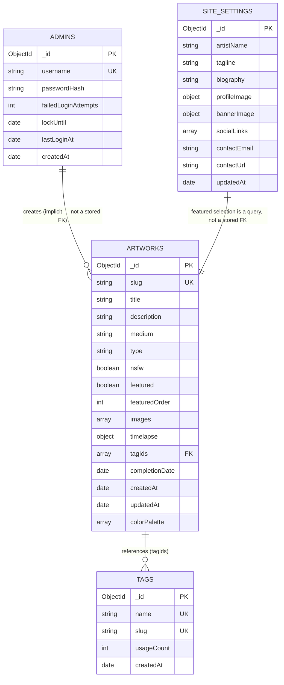

# 04 — Database Schema

> **Precedence: 5th.** This is the definitive reference for every piece of data BushArt stores. If `05-API-Specification.md` or any other document describes a field that contradicts this one, this document is correct.

---

## 1. Overview

BushArt uses **MongoDB Atlas (Free M0 cluster)** as its only structured datastore. Media bytes are never stored here — only references (Cloudinary `publicId`/URL pairs) to media stored in Cloudinary. There are four collections in the MVP, plus reserved space for near-term future collections.



Note on the diagram: MongoDB is not relational, and BushArt does not use `$lookup`-style joins at read time for the gallery feed (that would defeat the purpose of a document database at this scale). `tagIds` on an artwork is the one genuine reference; tag *names* for display are resolved via a single batch fetch of `tags` per gallery page, not a per-document join.

---

## 2. Naming Conventions

- Collection names: `snake_case`, plural — `artworks`, `tags`, `admins`, `site_settings`.
- Field names: `camelCase`.
- Every document has `createdAt`; documents that can be edited after creation also have `updatedAt`. Both are native BSON `Date`, stored in UTC.
- Foreign references are named `<collection-singular>Id` or `<collection-singular>Ids` (e.g., `tagIds`), and store `ObjectId` values, never stringified ids.
- Slugs (`artworks.slug`, `tags.slug`) are lowercase, hyphen-separated, generated server-side from the corresponding name/title at creation time (with a short random suffix appended only if a collision occurs).

---

## 3. Collection: `artworks`

The core collection. One document per published piece.

| Field | Type | Required | Notes |
|---|---|---|---|
| `_id` | `ObjectId` | auto | Primary key. |
| `slug` | `string` | yes | Unique. URL-safe identifier, derived from `title`. |
| `title` | `string` | yes | 1–200 chars. |
| `description` | `string` | no | Plain text/simple markdown, 0–5,000 chars. |
| `medium` | `string` | yes | Free text (e.g., "Digital painting", "Graphite on paper"). Not an enum — mediums are artist-defined and open-ended. |
| `type` | `string` | yes | Enum: `"personal"` \| `"commission"`. |
| `nsfw` | `boolean` | yes | Default `false`. |
| `featured` | `boolean` | yes | Default `false`. Controls homepage featured section membership. |
| `featuredOrder` | `number \| null` | no | Sort order within the featured set; `null` when `featured` is `false`. |
| `images` | `ImageAsset[]` | yes | At least 1 element. Ordered; index 0 is the primary/cover image used for thumbnails. |
| `timelapse` | `VideoAsset \| null` | no | Default `null`. |
| `tagIds` | `ObjectId[]` | yes | May be empty (tags are optional per `01-Product-Definition.md`). |
| `completionDate` | `Date` | yes | Artist-supplied; distinct from `createdAt` (system upload date). |
| `createdAt` | `Date` | auto | Set once, at insert. |
| `updatedAt` | `Date` | auto | Updated on every write. |
| `colorPalette` | `string[] \| null` | no | Reserved for the future automatic palette-extraction feature (`11-Project-Roadmap.md` V1.2). `null` until that feature ships; never populated manually. |

### Subdocument: `ImageAsset`

| Field | Type | Notes |
|---|---|---|
| `publicId` | `string` | Cloudinary public ID — the canonical reference; all transformation URLs are derived from this. |
| `url` | `string` | Cloudinary `secure_url` for the original, stored for convenience/fallback. |
| `width` | `number` | Original pixel width, from Cloudinary's upload response. |
| `height` | `number` | Original pixel height. |
| `order` | `number` | Zero-based position within the artwork's image sequence. |

### Subdocument: `VideoAsset`

| Field | Type | Notes |
|---|---|---|
| `publicId` | `string` | Cloudinary public ID for the video. |
| `url` | `string` | Cloudinary `secure_url`. |
| `durationSeconds` | `number` | From Cloudinary's upload response. |
| `width` | `number` | |
| `height` | `number` | |

### Validation Rules

- `images` must contain 1–20 elements (upper bound is a sane guardrail, not a hard product requirement).
- `type` must be exactly `"personal"` or `"commission"`.
- `slug` must match `^[a-z0-9]+(-[a-z0-9]+)*$` and be unique.
- `featuredOrder` is required (non-null) if and only if `featured` is `true`; enforced at the application layer (Zod), not as a MongoDB schema validator, to keep the database layer simple per the Constitution.
- `tagIds` elements must reference existing `tags` documents at write time (checked in the API layer before insert/update — see `05-API-Specification.md`).

### Example Document

```json
{
  "_id": "66a1f2b3c4d5e6f7a8b9c0d1",
  "slug": "moth-study-in-blue",
  "title": "Moth Study in Blue",
  "description": "A restrained gouache study exploring wing symmetry.",
  "medium": "Gouache on paper",
  "type": "personal",
  "nsfw": false,
  "featured": true,
  "featuredOrder": 1,
  "images": [
    {
      "publicId": "bushart/artworks/moth-study-in-blue/main",
      "url": "https://res.cloudinary.com/bushart/image/upload/v1721300000/bushart/artworks/moth-study-in-blue/main.jpg",
      "width": 3200,
      "height": 4000,
      "order": 0
    },
    {
      "publicId": "bushart/artworks/moth-study-in-blue/detail-1",
      "url": "https://res.cloudinary.com/bushart/image/upload/v1721300000/bushart/artworks/moth-study-in-blue/detail-1.jpg",
      "width": 3200,
      "height": 2400,
      "order": 1
    }
  ],
  "timelapse": {
    "publicId": "bushart/artworks/moth-study-in-blue/timelapse",
    "url": "https://res.cloudinary.com/bushart/video/upload/v1721300000/bushart/artworks/moth-study-in-blue/timelapse.mp4",
    "durationSeconds": 47,
    "width": 1920,
    "height": 1080
  },
  "tagIds": ["66a1e0a0c4d5e6f7a8b9c0aa", "66a1e0a0c4d5e6f7a8b9c0ab"],
  "completionDate": "2026-06-30T00:00:00.000Z",
  "createdAt": "2026-07-01T09:12:44.000Z",
  "updatedAt": "2026-07-01T09:12:44.000Z",
  "colorPalette": null
}
```

### Indexes

| Index | Fields | Purpose |
|---|---|---|
| `artworks_slug_unique` | `{ slug: 1 }`, unique | Slug lookups for artwork detail pages. |
| `artworks_gallery_feed` | `{ nsfw: 1, type: 1, completionDate: -1, _id: -1 }` | Primary compound index backing the filtered, sorted gallery feed and cursor pagination. |
| `artworks_tagIds` | `{ tagIds: 1 }` | Multikey index supporting tag-based filtering. |
| `artworks_createdAt` | `{ createdAt: -1 }` | Backs the "recently added" sort mode. |
| `artworks_featured` | `{ featured: 1, featuredOrder: 1 }` | Backs the homepage featured-section query. |

---

## 4. Collection: `tags`

The master tag list referenced by `artworks.tagIds`.

| Field | Type | Required | Notes |
|---|---|---|---|
| `_id` | `ObjectId` | auto | Primary key. |
| `name` | `string` | yes | Display name, 1–40 chars, unique (case-insensitive). |
| `slug` | `string` | yes | Unique, derived from `name`. |
| `usageCount` | `number` | yes | Denormalized count of artworks referencing this tag; default `0`. Maintained by the API layer on artwork create/update/delete (`05-API-Specification.md`), not recomputed by a scheduled job — there is no background job runner in this architecture. |
| `createdAt` | `Date` | auto | |

### Example Document

```json
{
  "_id": "66a1e0a0c4d5e6f7a8b9c0aa",
  "name": "Gouache",
  "slug": "gouache",
  "usageCount": 12,
  "createdAt": "2026-04-02T18:00:00.000Z"
}
```

### Deletion Behavior

Deleting a tag (`DELETE /api/tags/:id`) **cascades**: the tag's `_id` is pulled from every artwork's `tagIds` array in the same operation, and the tag document is removed. This matches the Product Definition's "remove unused tags later" requirement without forcing the artist to first untag every affected artwork by hand — consistent with the Constitution's "frictionless" principle. This is a deliberate design choice; see `12-Decision-Log.md` if it is ever revisited.

### Indexes

| Index | Fields | Purpose |
|---|---|---|
| `tags_slug_unique` | `{ slug: 1 }`, unique | Slug lookups. |
| `tags_name_unique` | `{ name: 1 }`, unique, collation case-insensitive | Prevents near-duplicate tags like "Gouache" and "gouache". |

---

## 5. Collection: `admins`

Administrator accounts. The MVP UI assumes exactly one document exists, but nothing in the schema enforces that, so adding a second administrator later (`11-Project-Roadmap.md` V2) requires no migration.

| Field | Type | Required | Notes |
|---|---|---|---|
| `_id` | `ObjectId` | auto | Primary key. |
| `username` | `string` | yes | Unique. |
| `passwordHash` | `string` | yes | bcrypt hash; never the plaintext password. |
| `failedLoginAttempts` | `number` | yes | Default `0`; reset on successful login. |
| `lockUntil` | `Date \| null` | no | Set when `failedLoginAttempts` reaches the threshold defined in `02-Technical-Specification.md` §4. |
| `lastLoginAt` | `Date \| null` | no | Updated on each successful login. |
| `createdAt` | `Date` | auto | |

This collection is **never** exposed through any public API response, in whole or in part, under any circumstance.

### Indexes

| Index | Fields | Purpose |
|---|---|---|
| `admins_username_unique` | `{ username: 1 }`, unique | Login lookups. |

---

## 6. Collection: `site_settings`

A **singleton** collection — exactly one document, holding all editable homepage/hero content described in `01-Product-Definition.md`. Enforced at the application layer by always upserting against a fixed, well-known filter rather than allowing free inserts.

| Field | Type | Required | Notes |
|---|---|---|---|
| `_id` | `ObjectId` | auto | Singleton; the app always queries with `findOne({})` since exactly one document ever exists. |
| `artistName` | `string` | yes | |
| `tagline` | `string` | no | Short subtitle shown under the artist name (e.g., "Digital Sketchbook & Gallery"). |
| `biography` | `string` | no | Rich text/simple markdown. |
| `profileImage` | `ImageAsset \| null` | no | Reuses the `ImageAsset` shape from §3. |
| `bannerImage` | `ImageAsset \| null` | no | |
| `socialLinks` | `SocialLink[]` | yes | May be empty array. |
| `contactEmail` | `string \| null` | no | |
| `contactUrl` | `string \| null` | no | E.g., a contact form or booking link, used instead of/alongside `contactEmail`. |
| `updatedAt` | `Date` | auto | |

### Subdocument: `SocialLink`

| Field | Type | Notes |
|---|---|---|
| `platform` | `string` | Free text label (e.g., "Instagram", "Bluesky"). |
| `url` | `string` | Full URL, validated at the application layer. |

### Example Document

```json
{
  "_id": "6690a0a0c4d5e6f7a8b9c000",
  "artistName": "Bush",
  "tagline": "Digital Sketchbook & Gallery",
  "biography": "I make quiet, restrained work in gouache and digital media...",
  "profileImage": {
    "publicId": "bushart/site/profile",
    "url": "https://res.cloudinary.com/bushart/image/upload/v1719800000/bushart/site/profile.jpg",
    "width": 800,
    "height": 800,
    "order": 0
  },
  "bannerImage": null,
  "socialLinks": [
    { "platform": "Instagram", "url": "https://instagram.com/example" },
    { "platform": "Bluesky", "url": "https://bsky.app/profile/example" }
  ],
  "contactEmail": "hello@example.com",
  "contactUrl": null,
  "updatedAt": "2026-07-10T12:00:00.000Z"
}
```

### Indexes

None required beyond the default `_id` index — this collection is read via `findOne({})` and holds a single document.

---

## 7. Reserved for Future Collections

These are **not created in the MVP**, but are documented here so future additions are planned rather than improvised, per the Constitution's "Future Growth" section.

| Collection | Introduced in | Purpose |
|---|---|---|
| `blog_posts` | V2 (`11-Project-Roadmap.md`) | Process writing / journal entries, separate from artwork records. |
| `collections` | V1.2 | Named, ordered groupings of existing `artworks` documents (e.g., a series), referencing `artworks._id` — additive, no change to the `artworks` schema required. |

---

## 8. Backup & Data-Loss Considerations

MongoDB Atlas's free M0 tier does **not** include automated backups (`02-Technical-Specification.md` §11). The mitigation — a scheduled export job — is documented operationally in `10-Deployment-Guide.md` §Backup Strategy; this document only notes the schema-level implication: because `artworks.images[].publicId` and `timelapse.publicId` are the *only* link between a MongoDB document and its Cloudinary media, a metadata backup that captures the `artworks` collection is sufficient to fully reconstruct the gallery (Cloudinary media persists independently and is not deleted by a MongoDB restore). There is no scenario in this schema where losing MongoDB data also destroys the underlying media, or vice versa — the two stores fail independently, which was a deliberate goal of keeping them separate (`12-Decision-Log.md` ADR-002, ADR-003).
