# 07 — User Flows

> **Precedence: 9th (part of "remaining documents").** This document translates `01-Product-Definition.md`'s user stories into concrete, step-by-step journeys, grounded in the screens described in `06-UI-Design-System.md` and the endpoints in `05-API-Specification.md`.

---

## Visitor Flows

### 1. Browse Gallery → Filter → Open Artwork

This is the primary, highest-traffic journey in the product, so it's documented as a single connected flow rather than three disconnected ones — in practice, visitors move fluidly between browsing, filtering, and opening pieces.

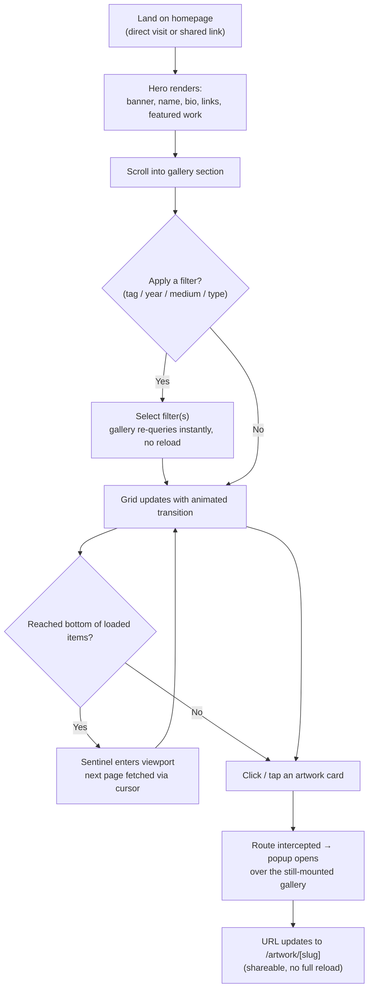

**Notes:**
- Switching the grid/list view mode (`06-UI-Design-System.md` §8) can happen at any point in this flow without resetting scroll position or active filters.
- The NSFW toggle (SFW default) is a persistent control available throughout browsing, not a one-time gate — see Flow 6.

### 2. Fullscreen Viewer

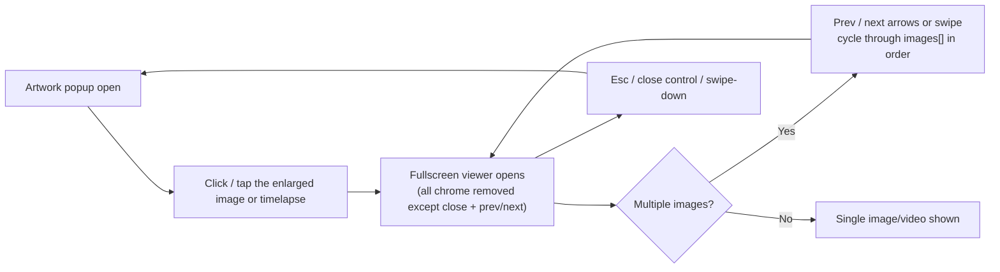

### 3. Download

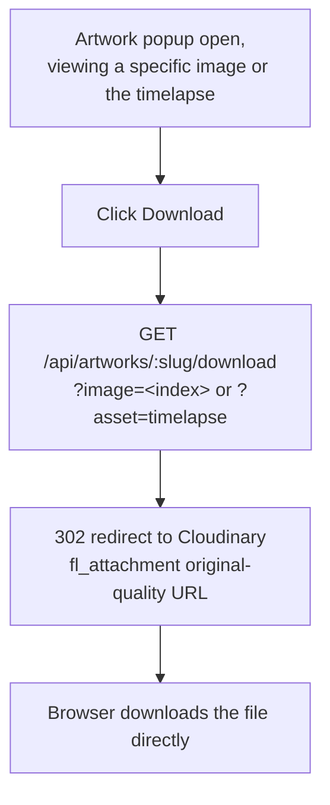

The application server is never in the file's data path (`03-System-Architecture.md` §4) — the download button's only job is producing the correct redirect.

### 4. Share

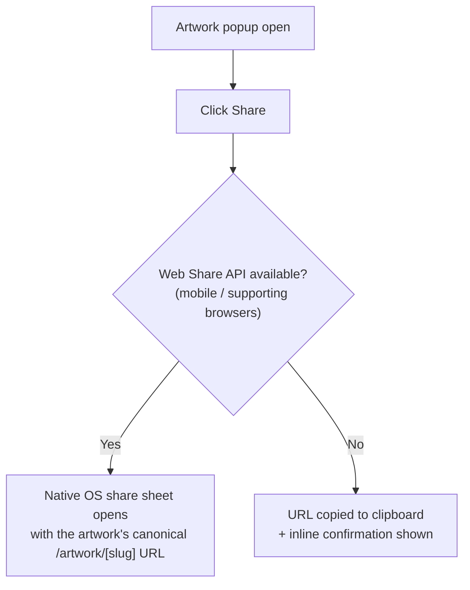

Because every artwork has a real, server-renderable route (`03-System-Architecture.md` §6), the shared link opens correctly for the recipient even if they've never visited BushArt before — it is not a fragile client-side-only deep link.

### 5. NSFW Toggle

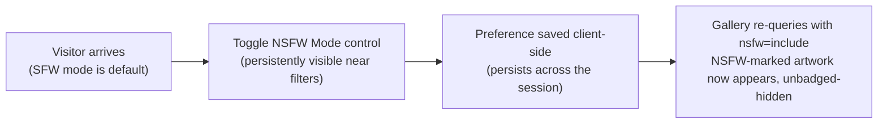

If a visitor follows a shared link directly to an NSFW-marked artwork while still in SFW mode, the detail route still resolves (per `05-API-Specification.md` §4.2's implementation note) but the UI shows a brief interstitial confirmation before rendering the media, rather than a bare 404 — this keeps direct links reliable while still respecting the visitor's stated preference.

---

## Administrator Flows

### 6. Login

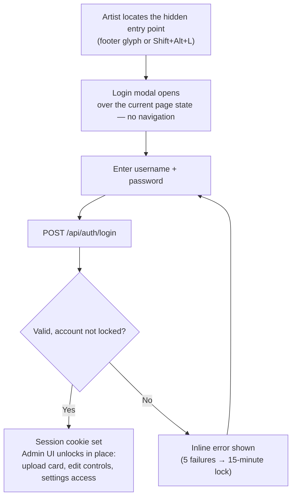

### 7. Upload Artwork

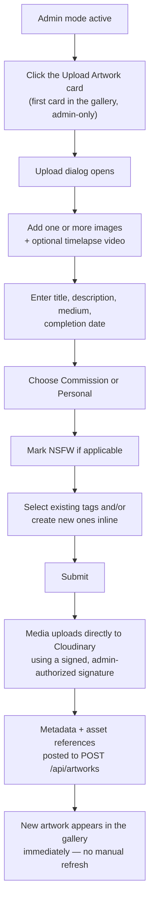

This is the flow the Constitution's "frictionless uploads" principle and `01-Product-Definition.md`'s "under 2 minutes for a standard upload" success metric are measured against. See `03-System-Architecture.md` §4 for the technical sequence behind steps J–K.

### 8. Edit Artwork

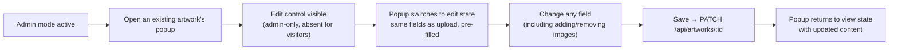

### 9. Manage Tags

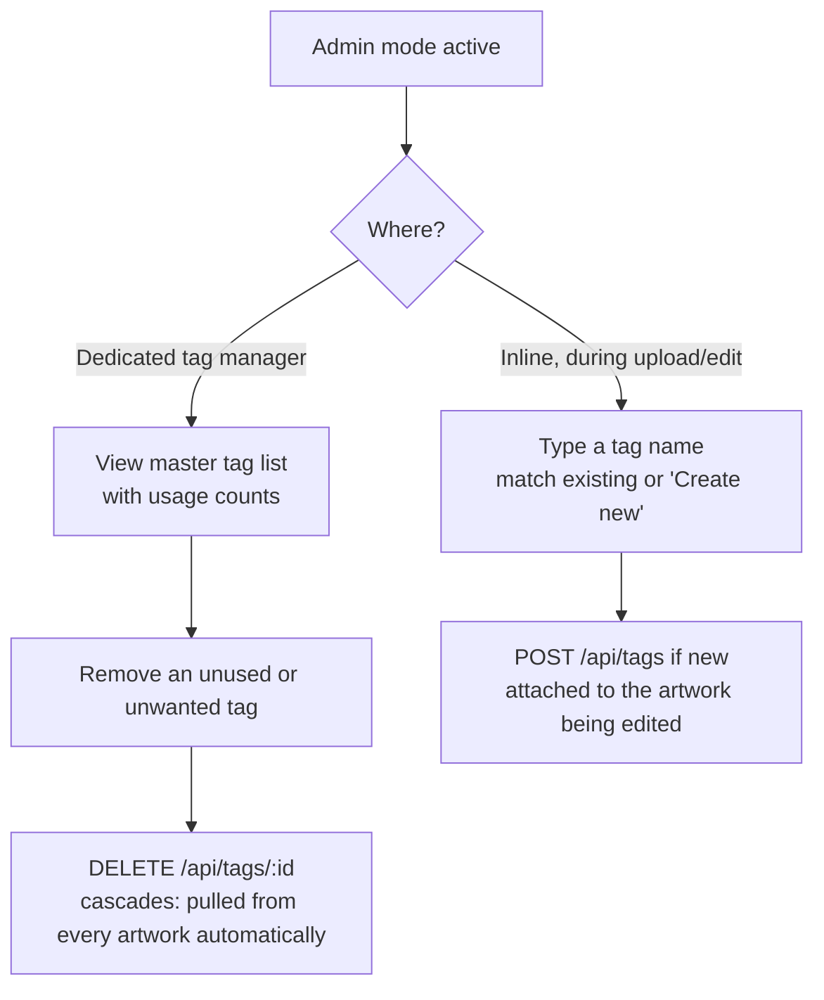

### 10. Update Homepage

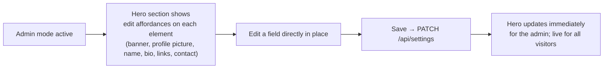

### 11. Manage Featured Artwork

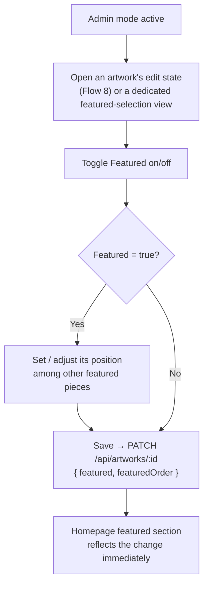

---

## Cross-Flow Notes

- Every admin flow above (6–11) assumes Flow 6 (Login) has already succeeded — none of them are reachable without a valid session, and every corresponding API call in `05-API-Specification.md` independently re-verifies that session server-side, per `02-Technical-Specification.md` §4.
- No flow in this document ever requires leaving the single continuously-scrolling homepage, except the fullscreen viewer (Flow 2) and the artwork detail route (Flow 1, step K) — both of which are overlays/route-interceptions rather than true navigations away from the gallery, consistent with the Constitution.
