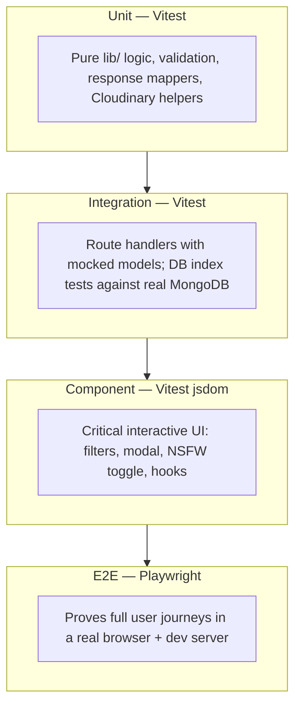
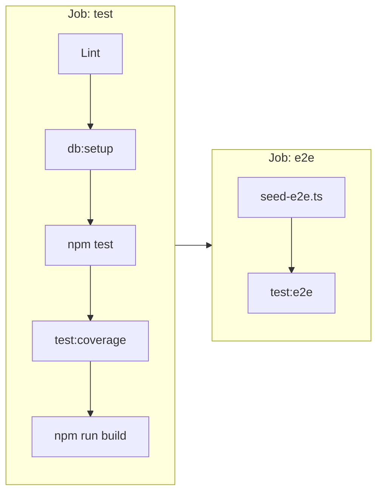

# Testing Infrastructure

> **High-level map of BushArt's automated testing.** Philosophy and risk-weighting rules live in `09-Coding-Standards.md` §13 — this document describes *what runs, where, and how*.

---

## 1. Purpose & Scope

BushArt uses a **risk-weighted testing pyramid**: heavy automation on business logic and write paths, lighter coverage on presentational UI, and targeted end-to-end flows for behaviors that would be embarrassing or damaging to break silently.

This document is the operational companion to `09-Coding-Standards.md` §13. If the two ever diverge on philosophy, §13 wins; if they diverge on tooling layout or CI behavior, this document should be updated to match reality.

---

## 2. Testing Pyramid



| Layer | Proves | Does not prove |
|---|---|---|
| **Unit** (`tests/lib/`) | Correctness of isolated functions — auth, validation, slug generation, API response shaping | MongoDB persistence, HTTP wiring, browser behavior |
| **Model unit** (`tests/db/models/`) | Document mapping and query logic with a mocked driver | Real index behavior or Atlas connectivity |
| **Route integration** (`tests/api/`) | Handler auth, validation, status codes, error envelopes via mocked `lib/` calls | End-to-end DB round-trips (see TODO-032) |
| **DB integration** (`tests/db-setup.test.ts`) | Index creation matches `04-Database-Schema.md` | Application logic |
| **Component / hook** (`tests/components/`, `tests/hooks/`) | Interactive UI behavior in jsdom | Layout fidelity, cross-browser quirks |
| **E2E** (`tests/e2e/`) | Full stack: routing, modal, gallery filters, NSFW persistence | Every admin CMS flow (Phase 7+) |

---

## 3. Tooling

| Tool | Role | Config |
|---|---|---|
| **Vitest 3** | Unit, integration, component, hook tests | `vitest.config.mts` |
| **@vitest/coverage-v8** | Coverage gate on required paths | Thresholds in `vitest.config.mts` |
| **Playwright** | Headless browser E2E | `playwright.config.ts` |
| **Testing Library** | Component/hook rendering and interaction | `tests/setup.ts` |
| **jsdom** | Browser-like environment for `*.test.tsx` | Vitest `component` project |

Vitest runs two projects:

- **`unit`** — Node environment, `tests/**/*.test.ts`
- **`component`** — jsdom environment, `tests/**/*.test.tsx`

---

## 4. Directory Layout

```text
tests/
├── setup.ts                 # Global mocks (server-only, matchMedia, IntersectionObserver)
├── helpers/                 # Shared fixtures and request builders
│   ├── fixtures/artwork.ts
│   ├── request.ts
│   └── index.ts
├── lib/                       # Unit tests mirroring src/lib/
│   ├── auth/
│   ├── api/
│   ├── cloudinary/
│   ├── db/
│   ├── utils/
│   └── validation/
├── db/                        # Model unit tests + db-setup integration
├── api/                       # Route handler tests (mocked models)
├── components/                # jsdom component tests
├── hooks/                     # jsdom hook tests
└── e2e/                       # Playwright specs (separate tsconfig)
    ├── fixtures.ts
    ├── global-setup.ts
    ├── artwork-modal.spec.ts
    └── gallery-browse.spec.ts
```

Authoritative repo layout: `08-Project-Structure.md`.

---

## 5. Commands

| Command | What it runs |
|---|---|
| `npm test` | Full Vitest suite (unit + component projects) |
| `npm run test:watch` | Vitest in watch mode |
| `npm run test:coverage` | Vitest with coverage gate on required paths |
| `npm run test:e2e` | Playwright E2E (starts dev server automatically) |
| `npm run test:e2e:install` | Install Chromium browser once |

**Local E2E:** set `MONGODB_URI` for direct-URL tests; otherwise intercept-path tests still run with mocked APIs. See `tests/e2e/README.md`.

---

## 6. CI Pipeline



Both jobs use a **MongoDB 7 service container**. The `test` job runs index integration tests and enforces the coverage gate; the `e2e` job seeds minimal artwork data then runs Playwright headlessly.

Workflow: `.github/workflows/ci.yml`.

---

## 7. Coverage Policy

Per `09-Coding-Standards.md` §13, the following paths **MUST** maintain passing coverage thresholds enforced in CI:

| Path | Why |
|---|---|
| `src/lib/auth/**` | Auth bypass or lockout bugs are high-impact |
| `src/lib/db/models/artwork.ts` | Write paths affect data integrity |
| `src/app/api/artworks/**` | Public read + admin write HTTP surface |

Thresholds (global across included files): **85%** lines/statements/functions, **80%** branches. Adjust only when measured baseline genuinely cannot reach the bar without gaming.

Run locally: `npm run test:coverage`.

---

## 8. Mocking Strategy

| Context | Approach |
|---|---|
| Route handler tests | `vi.mock()` on `@/lib/db/models/*`, `@/lib/auth/guard`, Cloudinary modules |
| Component tests | Mock `next/navigation`; inline factories or `tests/helpers/` fixtures |
| E2E intercept paths | `mockGalleryApis()` in `tests/e2e/fixtures.ts` — Playwright route interception |
| E2E direct URLs | Real MongoDB via `scripts/seed-e2e.ts` (CI + local with `MONGODB_URI`) |
| DB index tests | Real MongoDB — no mocks |

Shared helpers in `tests/helpers/` reduce duplication across API tests. Prefer importing helpers over copy-pasting fixture objects.

---

## 9. Known Gaps & Owning TODOs

| Gap | Owner |
|---|---|
| Real-MongoDB route integration (all 15 endpoints) | TODO-032 |
| Login + upload E2E flows | TODO-033 |
| Accessibility audit (`@axe-core/playwright`) | TODO-030 |
| MSW layer for multi-request hook tests | TODO-037 |
| Schema contract tests (Zod vs `04`/`05`) | TODO-038 |
| Visual regression baseline | TODO-039 |
| Post-deploy smoke automation | TODO-040 |
| Lighthouse CI performance budget | TODO-041 |
| Parallel E2E workers + flake policy | TODO-042 |
| Admin CMS component tests | TODO-023–028 (per feature) |

---

## 10. Adding Tests for New Work

When picking up a TODO item or new feature:

1. **Check `09-Coding-Standards.md` §13** — does this layer warrant tests at all?
2. **Match an existing sibling** — copy the pattern from the nearest test file in `tests/lib/`, `tests/api/`, or `tests/components/`.
3. **Use helpers** — if you need artwork fixtures or JSON requests, import from `tests/helpers/`.
4. **Route handlers** — mock model layer unless the work is explicitly TODO-032 real-DB integration.
5. **User-facing flows** — add or extend a Playwright spec under `tests/e2e/` when the flow is listed in `07-User-Flows.md` and would be damaging to break silently.
6. **Touching auth or artwork writes** — confirm `npm run test:coverage` still passes before marking work done.

---

*For agent onboarding, see also `AGENT.md`. For the active build queue, see `TODO.md`.*
